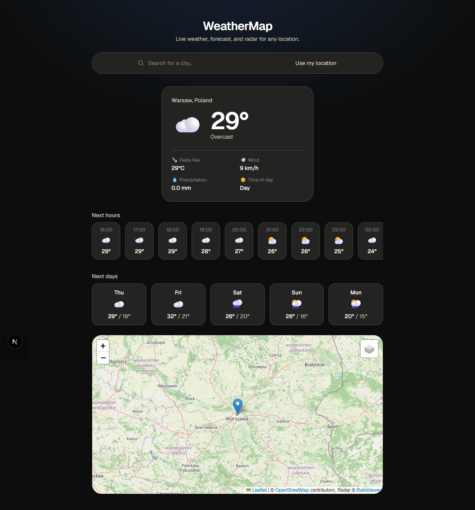
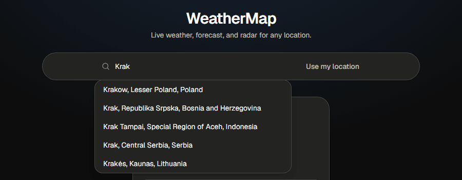
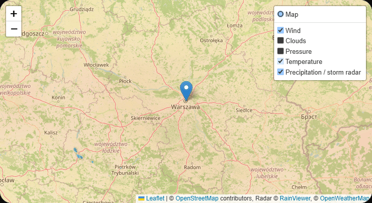
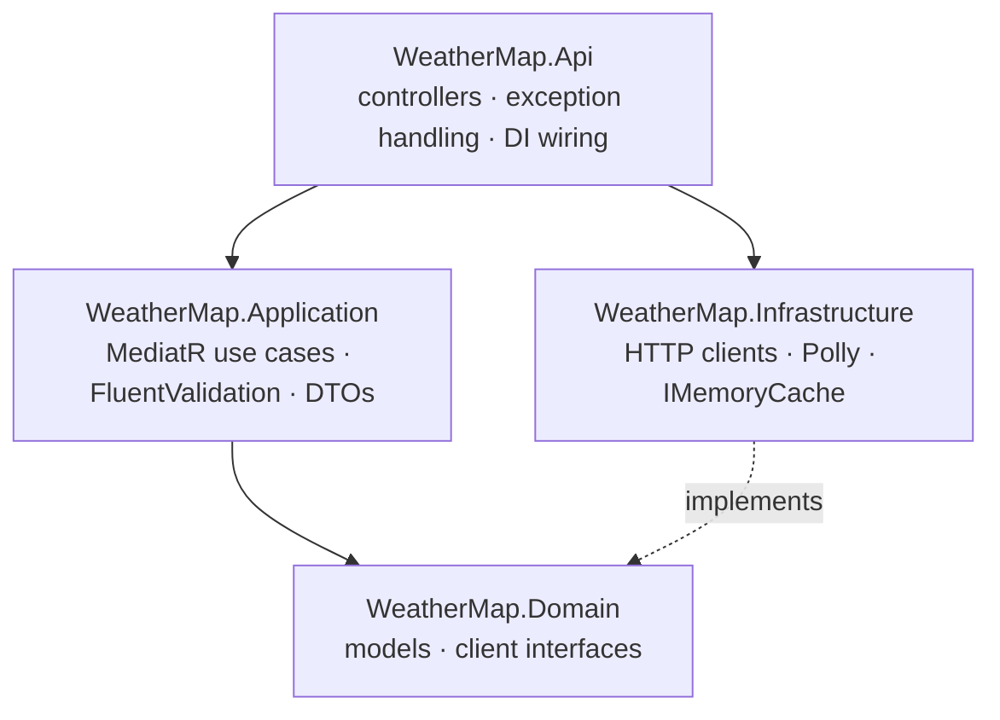
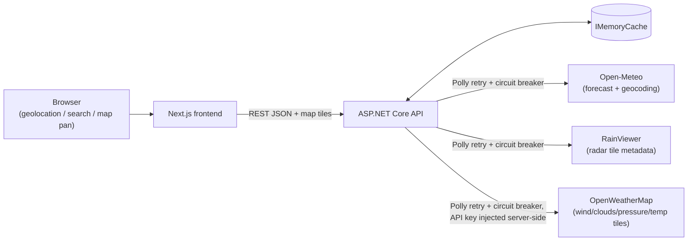

# WeatherMap

A portfolio project: a .NET Web API that aggregates and proxies several external weather
data sources, paired with a Next.js frontend that visualizes the result — current
conditions, an hourly/daily forecast, and an interactive map with live precipitation
radar and wind/cloud/pressure/temperature layers.

No login, no database, no SignalR — the backend is a deliberately lightweight, stateless
aggregator. The point of the project is the integration and architecture work, not
infrastructure.



## Features

- Location search (Open-Meteo geocoding) or opt-in browser geolocation via a "Use my
  location" button — defaults to Warsaw on first visit rather than auto-prompting for a
  system permission
- Current conditions, hourly and daily forecast
- Interactive Leaflet map with toggleable layers: precipitation/storm radar (RainViewer)
  and wind, clouds, pressure, and temperature (OpenWeatherMap)
- Last selected location remembered in `localStorage`
- Backend-side caching (`IMemoryCache`) and resilience (Polly retry + circuit breaker) on
  every external API call
- Health checks (`/health`) for the API and its external dependencies

<table>
<tr><td></td>
<td></td></tr>
</table>

## Architecture

The backend follows Clean Architecture — dependencies point inward, and the outer layers
depend on abstractions defined by the inner ones:



- **Domain** — plain models (`Location`, `CurrentConditions`, `Forecast`, `RadarInfo`, ...)
  and the client interfaces (`IGeocodingClient`, `IWeatherClient`, `IRadarClient`,
  `IWeatherTileClient`) that Application depends on. No external dependencies.
- **Application** — one MediatR query per use case, each with a FluentValidation
  validator run through a shared pipeline behavior, mapping Domain models to DTOs.
- **Infrastructure** — a typed `HttpClient` per external provider, wrapped in a Polly
  retry + circuit-breaker policy, wrapped again in an `IMemoryCache` decorator (the
  provider-specific client and the cache are separate classes, both implementing the
  same Domain interface).
- **Api** — thin controllers that just send a query through MediatR; a global
  `IExceptionHandler` maps validation failures to 400 and upstream provider failures
  (timeouts, open circuit breakers, non-2xx responses) to 503, both as ProblemDetails.

### Data flow



The backend normalizes all three providers into one DTO contract and never exposes
provider details (including the OpenWeatherMap API key) to the frontend — map tiles are
proxied through the backend the same way as any other endpoint, not fetched directly by
the browser.

## Tech stack

**Backend** — .NET 8, ASP.NET Core Web API, MediatR, FluentValidation, Polly,
`IMemoryCache`, xUnit + Moq (unit tests), `WebApplicationFactory` (integration tests).

**Frontend** — Next.js (App Router) + TypeScript, TanStack Query, Leaflet /
`react-leaflet`, Tailwind CSS.

**External APIs** — [Open-Meteo](https://open-meteo.com/) (forecast + geocoding, no key),
[RainViewer](https://www.rainviewer.com/) (radar tiles, no key),
[OpenWeatherMap](https://openweathermap.org/) (wind/clouds/pressure/temperature tiles,
free API key required).

## API endpoints

| Endpoint | Description |
|---|---|
| `GET /api/locations/search?query=&count=` | Geocode a place name to candidate locations |
| `GET /api/weather/current?lat=&lon=` | Current conditions for a coordinate |
| `GET /api/weather/forecast?lat=&lon=&days=` | Hourly + daily forecast |
| `GET /api/weather/radar-tiles` | RainViewer frame metadata (host + past/nowcast paths) |
| `GET /api/weather/map-tiles/{layer}/{z}/{x}/{y}` | Proxied OpenWeatherMap tile; `layer` is one of `wind_new`, `clouds_new`, `precipitation_new`, `pressure_new`, `temp_new` |
| `GET /health` | Health check, including live reachability of Open-Meteo and RainViewer |

## Getting started

### Backend

```bash
dotnet restore
dotnet build
dotnet test
dotnet run --project src/WeatherMap.Api
```

The map's wind/clouds/pressure/temperature layers need a free OpenWeatherMap API key
(open-meteo and RainViewer need none). Sign up at
[openweathermap.org](https://openweathermap.org/), then set the key locally without
committing it:

```bash
dotnet user-secrets set "OpenWeatherMap:ApiKey" "<your-key>" --project src/WeatherMap.Api
```

In deployment, set it as an environment variable instead: `OpenWeatherMap__ApiKey`.

### Frontend

```bash
cd frontend
npm install
cp .env.example .env.local   # NEXT_PUBLIC_API_BASE_URL, defaults to http://localhost:5230
npm run dev
```

## Project structure

```
src/
  WeatherMap.Domain/          # models, client interfaces
  WeatherMap.Application/     # MediatR use cases, DTOs, validation
  WeatherMap.Infrastructure/  # HTTP clients (Open-Meteo/RainViewer/OpenWeatherMap), Polly, IMemoryCache
  WeatherMap.Api/             # controllers, exception handling, DI wiring
tests/
  WeatherMap.UnitTests/
  WeatherMap.IntegrationTests/
frontend/                     # Next.js (App Router) + TypeScript
docs/                         # screenshots (architecture is documented above, in this README)
```

See [CLAUDE.md](./CLAUDE.md) for the full project spec — goals, staged build plan,
technical risks and the decisions made along the way (e.g. why the map's weather layers
are an OpenWeatherMap tile proxy rather than a custom vector-field grid).

## Deployment

Suggested free-tier setup: **Vercel** for the frontend (built for Next.js, zero-config),
**Render** for the backend (Docker deploy, no credit card — the free tier spins down
after 15 minutes idle, so the first request after a while takes 30-60s to cold-start).
Since the two live on different domains, the backend's CORS config
(`Cors:AllowedOrigins`) needs the Vercel domain added alongside `localhost`.
